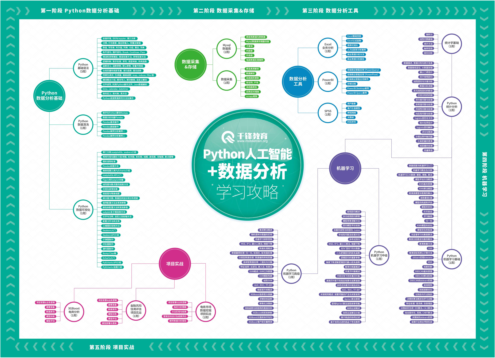

## Python Learning Records

重新学习[Python-100-Days](https://github.com/jackfrued/Python-100-Days)，查漏补缺

 

使用**Jupyter**实现markdown edit与code工作.

**项目暂时只适用于我个人**

* ## [Python 语法基础](./Python语法基础)

* ## [Python OOP设计](./Python面向对象设计)

* ## [Python IO/Thread/Error](./PythonIO-多线程-异常)

* ## [Python Network&ImageProcess](./Python网络编程与图像处理基础)

* ## [Python 常见模块](./Python常见模块)

* ## [Python 数据处理](./Python数据处理)